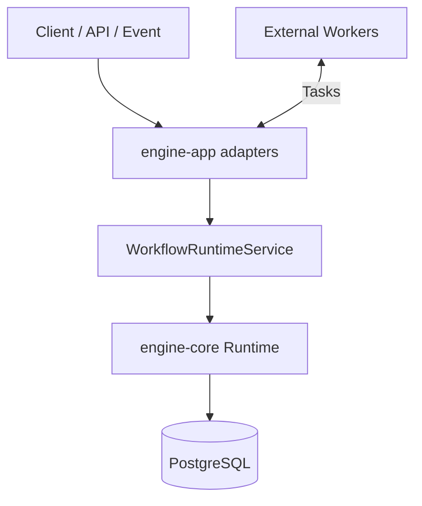
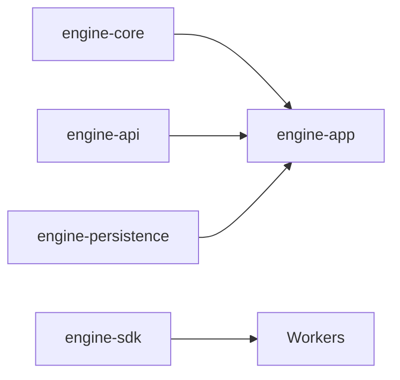
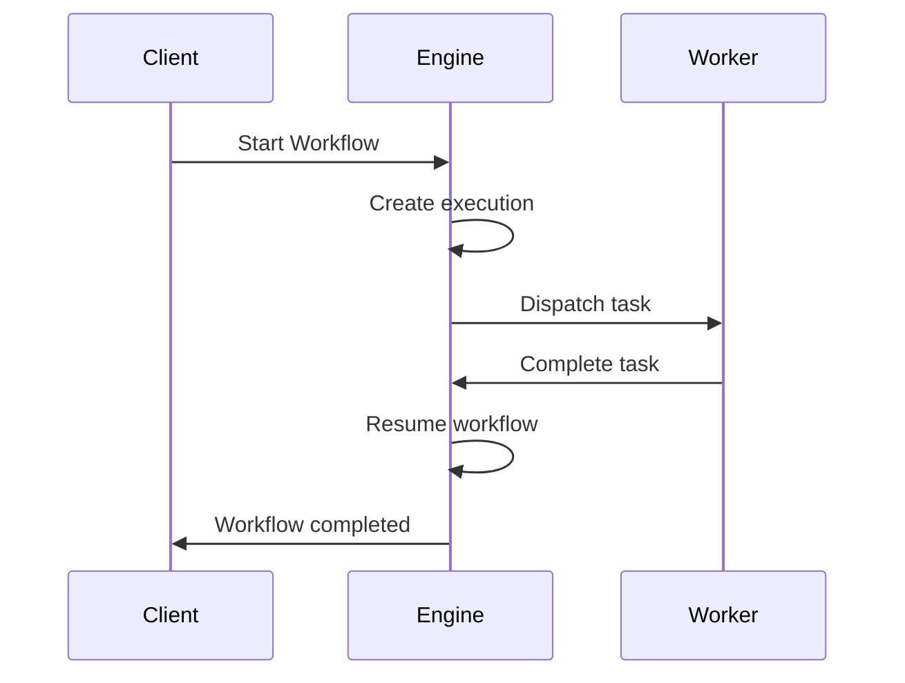

# 🚀 Nexflow Engine

Nexflow Engine is a **headless, event-driven workflow runtime** for building **durable, long-running, and idempotent workflows**.

It is designed for backend engineers and platform teams who need **reliable orchestration** without UI or SaaS lock-in.

> Nexflow Engine is the **kernel** of the Nexflow platform.  
> Studio, Cloud, and enterprise products are built **on top of this engine**, not inside it.

---

## ✨ Key Characteristics

- Headless & embeddable
- Event-driven execution model
- Durable state (crash-safe)
- Deterministic workflows
- Built-in retries & failure handling
- Time & event-based waits
- Idempotency at all boundaries

---

## 🧠 What Nexflow Engine Is / Is Not

### ✅ Is
- A workflow runtime
- A state machine executor
- A task orchestration engine
- A foundation for higher-level products

### ❌ Is Not
- A low-code / no-code tool
- A visual workflow builder
- A message broker
- A cron replacement only

---

## 🏗 High-Level Architecture



---

## 📦 Module Architecture



### Module Responsibilities

| Module | Responsibility |
|------|----------------|
| engine-core | Pure workflow runtime (no Spring) |
| engine-api | API contracts & models |
| engine-app | REST, scheduling, orchestration |
| engine-persistence | JPA entities & repositories |
| engine-sdk | Worker & client SDK |

---

## 🧩 Core Concepts

| Concept | Description |
|------|------------|
| Workflow | Deterministic state machine |
| Step | Unit of execution |
| Task | External work |
| Execution | One workflow instance |
| Wait | Time or event pause |
| Retry | Engine-controlled retry |
| Idempotency | Safe duplicate handling |

---

## 📜 Workflow DSL (v1)

Workflows are defined in JSON or YAML.

```json
{
  "name": "hello-workflow",
  "version": 1,
  "start": "say_hello",
  "steps": {
    "say_hello": {
      "type": "task",
      "task": "helloTask",
      "onSuccess": "end"
    },
    "end": {
      "type": "end",
      "status": "COMPLETED"
    }
  }
}
```

---

## 🔁 Execution Model



---

## ⏳ WAIT Semantics

### Time-based WAIT
```json
{
  "type": "wait",
  "duration": "PT5M",
  "next": "retry_step"
}
```

### Event-based WAIT
```json
{
  "type": "wait",
  "event": "PAYMENT_RECEIVED",
  "next": "ship_order"
}
```

---

## 🔐 Idempotency

Idempotency is enforced using durable keys in the database.

| Boundary | Scope |
|--------|-------|
| Workflow start | WORKFLOW_START |
| Task completion | TASK_COMPLETE |
| Event resume | EVENT_RESUME |

---

## 👷 Worker Model

```java
public interface NexflowWorker {
    String taskName();
    Map<String, Object> execute(Map<String, Object> input);
}
```

---

## 🚀 Getting Started

```bash
mvn clean install
cd engine-app
mvn spring-boot:run
```

---

## 🛣 Roadmap

- Parallel steps
- Sub-workflows
- Studio (visual builder)
- Cloud (managed SaaS)

---

## 📄 License

Apache License 2.0

---

> Make failures boring. Make retries safe. Make workflows explicit.
